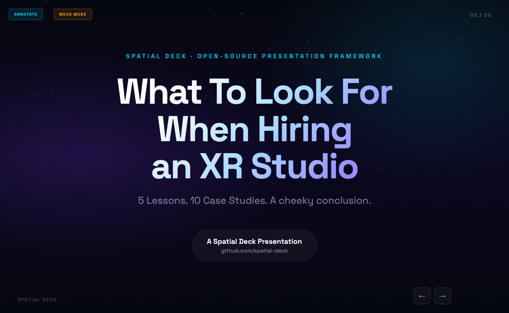
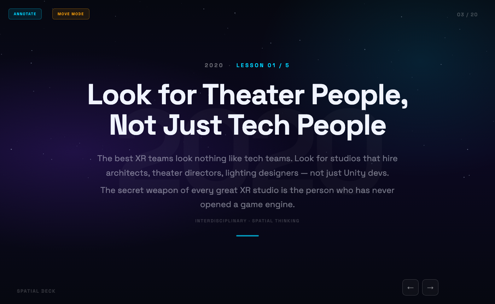
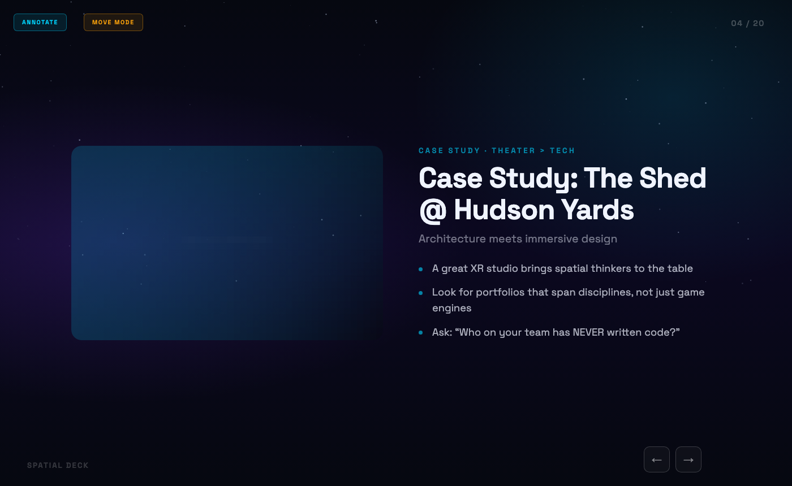
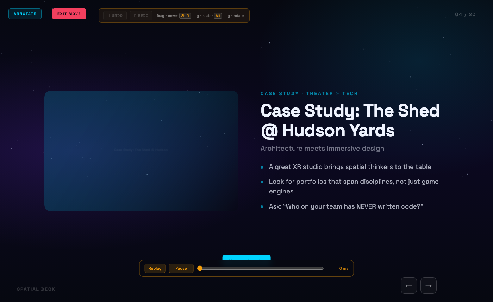
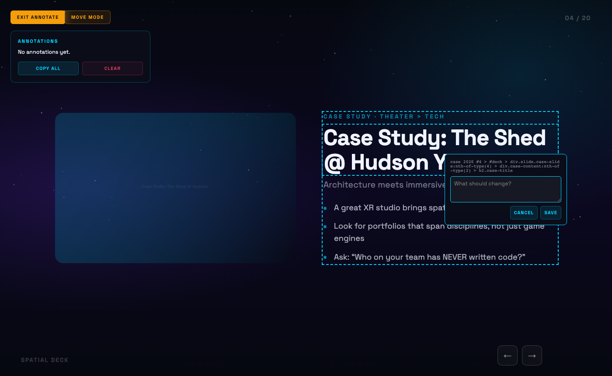
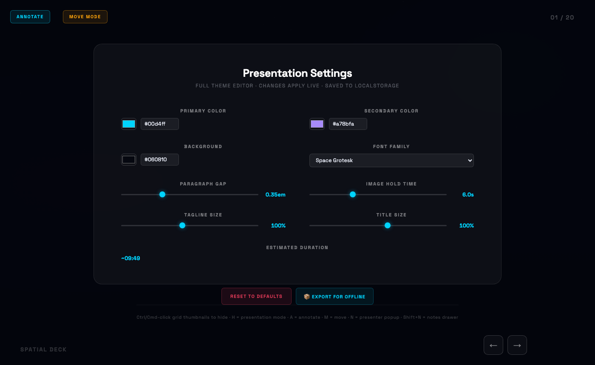
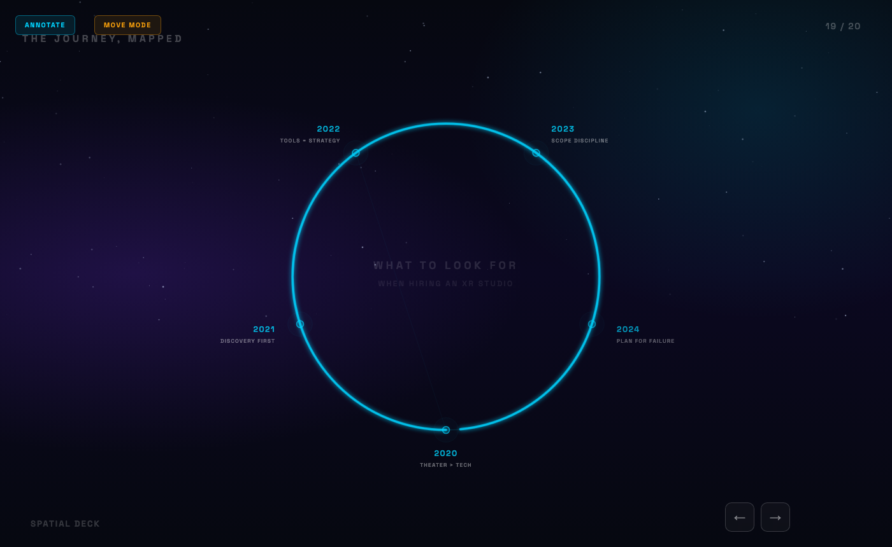
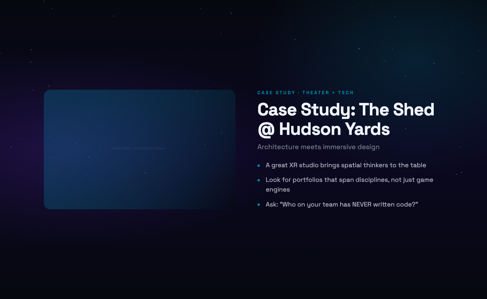

# 🎭 Spatial Deck

**The presentation framework for people who think spatially.**

A single-file HTML presentation system built for XR professionals, creative technologists, and anyone who wants more control over their slides than PowerPoint will ever give you. Zero dependencies. Zero build process. One file to rule them all.

> *Designed at [Agile Lens](https://agilelens.com) — a 10-year-old immersive design studio that has given talks at Harvard, SIGGRAPH, the Kennedy Center, and everywhere in between.*



---

## 📖 Origin Story

In April 2026, [Alex Coulombe](https://twitter.com/ibrews) was asked to give the closing keynote at the [Harvard XR Conference](https://harvardxr.com). The talk — *"10 Lessons from 10 Years"* — needed to cover a decade of building XR experiences at Agile Lens.

PowerPoint wasn't going to cut it.

Alex needed a presentation system that could handle animated pixel-art avatars, canvas-based media galleries with pixelated reveal effects, Web Audio sound design, an interactive constellation map, live annotation and repositioning of any element, and — critically — the ability to iterate on slides *with an AI collaborator* right up until showtime. All in a single HTML file that could run from a USB stick at a Harvard podium.

So he built one. With Claude.

The Harvard keynote was a hit. The framework that powered it became **Spatial Deck** — extracted, generalized, and open-sourced so anyone can build presentations that feel as alive as the work they're presenting.

**[See the original Harvard keynote →](https://ibrews.github.io/harvardxr-keynote/)**

---

## ✨ What Makes This Different

| Feature | PowerPoint | Google Slides | Spatial Deck |
|---------|-----------|--------------|-------------|
| Single file, no cloud | ❌ | ❌ | ✅ |
| Live annotation mode | ❌ | ❌ | ✅ |
| Drag-to-reposition anything | ❌ | ✅ | ✅ |
| Undo/redo in layout mode | ✅ | ✅ | ✅ |
| Media cycler with pixelated reveal | ❌ | ❌ | ✅ |
| Animated constellation map | ❌ | ❌ | ✅ |
| Web Audio sound effects | ❌ | ❌ | ✅ |
| Full theme editor (live) | Limited | Limited | ✅ |
| Speaker notes + timing estimator | ✅ | ✅ | ✅ |
| Multi-step slide animations | Limited | Limited | ✅ |
| Works offline from a USB stick | ❌ | ❌ | ✅ |
| AI-friendly (LLM can edit it) | ❌ | ❌ | ✅ |
| Version control with Git | ❌ | ❌ | ✅ |
| Runs on any device with a browser | ❌ | ✅ | ✅ |

---

## 🚀 Quick Start

```bash
# Clone it
git clone https://github.com/ibrews/spatial-deck.git
cd spatial-deck

# Open it
open index.html
# That's it. No npm install. No webpack. No tears.
```

---

## Things to Try

1. **Open `index.html` in any browser** — the cover slide loads instantly with no build step; press `→` or `Space` to advance through the sample presentation.
2. **Press `M` to enter Move Mode, then drag the title on any slide** — a position like `left:45%, top:32%` auto-copies to your clipboard so you can pass exact coordinates to an AI collaborator.
3. **Press `A` to enter Annotation Mode and click anywhere on a slide** — a note panel appears; click Export to get all annotations as copyable markdown for AI handoff.
4. **Open slide 0 (Settings, accessible via the slide grid) and change the font family or accent color** — the entire deck re-themes live without a reload; settings persist across browser restarts.
5. **Press `N` to open the Presenter Popup, then navigate a few slides** — a second window tracks speaker notes, elapsed time, next-slide preview, and a pacing indicator (green / yellow / red).

---

## 🎯 How It Works

### The SECTIONS Array

Everything in your presentation is driven by a single JavaScript array at the top of `index.html`:

```javascript
const SECTIONS = [
  {
    year: 2024, accent: 'teal',
    lesson: {
      title: 'Your Lesson Title\nWith Line Breaks',
      tagline: 'The body text that explains the lesson...',
      short: 'SHORT TAG',
      tags: 'Tag One · Tag Two · Tag Three',
      notes: 'Speaker notes: what to say when this slide is up'
    },
    cases: [
      {
        title: 'Case Study Title',
        subtitle: 'One-line description',
        img: 'MEDIA_CYCLER',  // or 'path/to/image.jpg' or 'IFRAME:url' or ''
        bullets: ['Point one', 'Point two', 'Point three'],
        notes: 'Talking points for this case study'
      },
    ]
  },
  // ... more sections
];
```

Change the data → the slides update. That's the whole mental model.

### Lesson Slides

Each section generates a lesson slide with the year, lesson number, title, and tagline:



### Case Study Slides

Case studies show an image/media area alongside the title, subtitle, and bullet points:



### Slide Types

| Type | Created From | Purpose |
|------|-------------|---------|
| `cover` | Hardcoded | Title slide |
| `lesson` | `SECTIONS[].lesson` | Year + lesson title + tagline |
| `case` | `SECTIONS[].cases[]` | Image/media + title + bullets |
| `bonus` | `BONUS` const | Special amber-accent closer |
| `map` | Auto-generated | Animated constellation of all lessons |
| `close` | Hardcoded | QR codes + contact info |
| `settings` | Auto-generated | Hidden slide 0 with live controls |

---

## 🎮 Keyboard Shortcuts

### Presentation Mode
| Key | Action |
|-----|--------|
| `→` `Space` `PageDown` | Next slide |
| `←` `PageUp` | Previous slide |
| `Home` | First slide |
| `End` | Last slide |
| `H` | Toggle UI chrome (presentation mode) |
| `G` | Toggle layout grid (in move mode) |
| `Cmd/Ctrl + F` or `/` | Search all slide text |
| `N` | Open presenter popup (speaker notes) |
| `Shift + N` | Toggle inline notes drawer |
| `👁` button (mobile) | Toggle UI chrome on touch devices |

### URL Sharing Modes

| URL | Mode |
|-----|------|
| `yoursite.com/` | View mode (default) — clean, no edit chrome |
| `yoursite.com/?edit` | Edit mode — all chrome visible, even on mobile |
| `yoursite.com/?view` | Explicit view mode (same as default) |
| `yoursite.com/?landscape` | Shows "rotate to landscape" prompt on portrait phones |
| `yoursite.com/?edit#15` | Edit mode, starting at slide 15 |

### Mobile Support

- **Auto-detect**: phones/tablets auto-enter presentation mode (clean view)
- **Tap**: quick tap anywhere advances steps or slides
- **Swipe left/right**: navigate forward/backward (respects steps + hidden slides)
- **👁 button**: top-right toggle to show/hide UI chrome

### Move Mode (`M` to toggle)



*Move mode shows a HUD with modifier hints. Drag any element to reposition it. Transforms are auto-saved as annotations (type: 'move'). The animation scrubber at the bottom lets you replay slide animations and set keyframe animations.*

| Key/Action | Effect |
|------------|--------|
| `Drag` | Translate element |
| `Shift + Drag` | Scale element |
| `Alt/Option + Drag` | Rotate element |
| `Cmd/Ctrl + Click` | Select parent element |
| `G` | Toggle layout grid (4×3 zone overlay, A1–C4) |
| `▲▲` button | Send selected element to front |
| `▲` button | Send selected element forward |
| `▼` button | Send selected element backward |
| `▼▼` button | Send selected element to back |
| `Cmd/Ctrl + Z` | Undo |
| `Cmd/Ctrl + Shift + Z` | Redo |
| `Double-click` | Edit text inline |

### Keyframe Animation (in Move Mode)

The scrubber timeline supports keyframe-based animation via the Web Animations API (WAAPI):

| Action | Effect |
|--------|--------|
| `◆ KF` button | Capture last-moved element's transform at current scrub time |
| Diamond markers (◆) on timeline | Show existing keyframes — click to seek |
| `✕ KF` button | Delete the keyframe at current scrub time |

Two or more keyframes on the same element build a WAAPI animation automatically. Keyframes are persisted as annotations (`type: 'keyframe'`).

### Text Editing (double-click in Move Mode)
| Key | Effect |
|-----|--------|
| `Enter` | New bullet (when editing a `<li>`) |
| `Shift + Enter` | Line break within element |
| `Backspace` on empty bullet | Delete bullet |
| `Cmd/Ctrl + Enter` | Save and exit edit mode |
| `Escape` | Cancel edit |

### Annotation Mode (`A` to toggle)



*Click any element to leave a note. Click the slide background to mark a position (coordinates exported as `left:X%, top:Y%`). The annotation panel tracks all notes. Export as markdown for handoff to collaborators or AI.*

| Action | Effect |
|--------|--------|
| Click any element | Add a note |
| Export button | Copy all annotations as markdown |

### Media Cycler (on slides with image/video galleries)
| Key | Effect |
|-----|--------|
| `Shift + →` | Next image/video |
| `Shift + ←` | Previous image/video |
| `Shift + ↑` | Resume auto-advance |

---

## 🎨 Theme Editor

The Settings slide (hidden slide 0, accessible via the slide grid) includes a full live theme editor:



- **Primary & Secondary Colors** — hex color pickers that update accent colors throughout
- **Background Darkness** — adjust the base background
- **Font Family** — choose from Space Grotesk, Inter, Outfit, JetBrains Mono, Playfair Display, or enter any Google Font name
- **Title Scale** — adjust title font sizes (60%–130%)
- **Tagline Scale** — adjust body text sizes (60%–150%)
- **Paragraph Gap** — control spacing on double line breaks
- **Image Hold Duration** — how long images display before cycling
- **Reset to Defaults** — one click to restore everything

All settings persist via `localStorage` — they survive page reloads and browser restarts.

### Arrow Substep Toggle

In Settings: **"Arrow substep"** On/Off (default: On)
- **On**: clicking →, tapping, or swiping steps through sub-animations before advancing to the next slide
- **Off**: every click goes straight to the next full slide

### SFX Cleanup

All playing sound effects are automatically killed when navigating to a new slide — no lingering audio from previous animations. Uses an `AudioContext` monkey-patch for zero-config tracking.

### Slide Transitions

Choose your transition style from the Settings dropdown:

| Style | Effect |
|-------|--------|
| **Slide** (default) | Horizontal slide left/right |
| **Fade** | Simple opacity crossfade |
| **Zoom** | Scale + fade (zoom in forward, zoom out backward) |
| **None** | Instant swap, no animation |

### Auto-Save & Restore

Your work is automatically saved every 60 seconds (after first interaction):
- Keeps the last 10 snapshots of your annotations and theme settings
- Click **"🔄 Restore Snapshot"** in Settings to see timestamped backups
- Pick any snapshot to restore — annotations and config are rolled back and the page reloads

---

## 📐 Layout Grid & Positioning

Press `G` in move mode to toggle a 4×3 labeled grid overlay:

```
 A1  |  A2  |  A3  |  A4
-----+------+------+-----
 B1  |  B2  |  B3  |  B4
-----+------+------+-----
 C1  |  C2  |  C3  |  C4
```

- Zone labels appear on the slide so you can say "put the logo in zone A4"
- When the grid is visible, annotations include the zone (e.g., `Zone: B2`)
- After dragging any element, the CSS position is **auto-copied to your clipboard**:
  ```
  📋 Position copied: left:45%, top:32%
  ```
- Clicking the slide background in annotation mode captures exact coordinates:
  ```
  POSITION: left:45.2%, top:32.1% (on slide #15, type: lesson, year: 2023)
  ```

This solves the "put X here" problem — your AI collaborator gets exact coordinates, not vague descriptions.

---

## 🎥 Embedded Content (iframes)

Embed YouTube videos, Unreal Engine pixel streams, Sketchfab models, or any web content directly in a case study slide:

```javascript
// In SECTIONS:
{ title: 'Live Demo', 
  img: 'IFRAME:https://www.youtube.com/embed/dQw4w9WgXcQ',
  bullets: ['This video plays right on the slide'] }
```

The `IFRAME:` prefix tells Spatial Deck to embed a responsive iframe instead of an image. Works with:

| Source | Example `img` Value |
|--------|-------------------|
| **YouTube** | `'IFRAME:https://www.youtube.com/embed/VIDEO_ID'` |
| **Vimeo** | `'IFRAME:https://player.vimeo.com/video/VIDEO_ID'` |
| **Pixel Streaming** | `'IFRAME:https://your-server.com/stream'` |
| **Sketchfab** | `'IFRAME:https://sketchfab.com/models/ID/embed'` |
| **Any URL** | `'IFRAME:https://example.com'` |

The iframe gets `allow="autoplay;fullscreen;xr-spatial-tracking"` by default — suitable for XR streaming and immersive content.

---

## 🖼️ Media Cycler

The media cycler is a canvas-based image/video gallery with a distinctive pixelated reveal effect.

### How to Use

Set `img: 'MEDIA_CYCLER'` on a case study, then add a cycler IIFE after the SECTIONS loop:

```javascript
// In SECTIONS:
{ title: 'My Project', img: 'MEDIA_CYCLER', ... }

// After the build loop:
(function(){
  const slide = allSlides.find(s =>
    s.querySelector?.('.case-title')?.textContent.includes('My Project'));
  if (!slide) return;
  buildMediaCycler(slide, [
    {type:'image', src:'media/project/photo1.jpg'},
    {type:'image', src:'media/project/photo2.jpg', flipH: true},
    {type:'video', src:'media/project/demo.mp4', loop: true},
  ], {imageDuration: 6000});
})();
```

### Options

| Option | Default | Description |
|--------|---------|-------------|
| `imageDuration` | `6000` | Milliseconds to hold each image |
| `portrait` | `false` | 9:16 canvas for vertical content |
| `enterDur` | `700` | Slide-in duration (ms) |
| `revealDur` | `1600` | De-pixelation reveal (ms) |
| `exitDur` | `500` | Exit animation (ms) |

### Per-Item Flags

| Flag | Description |
|------|-------------|
| `flipH: true` | Mirror the image horizontally |
| `loop: true` | Loop a video continuously |

### Direct Image Paths

Case studies with `img: 'path/to/image.jpg'` render as standard `` tags (no media cycler, no pixelated reveal). Use `MEDIA_CYCLER` with a single-item array if you want the canvas-based reveal effect on a single image.

---

## 📝 Speaker Notes & Timing

### Adding Notes

```javascript
lesson: {
  title: 'My Lesson',
  notes: 'Key talking point. Pause for effect. Ask the audience a question.'
},
cases: [{
  title: 'Case Study',
  notes: '• Mention the budget\n• Show the before/after\n• This is where the client cried'
}]
```

### Presenter Popup (`N`)

Opens a second window showing:
- Current slide title and notes
- Next slide preview
- Elapsed time (MM:SS)
- Estimated remaining time
- Pacing indicator (🟢 on pace / 🟡 running long / 🔴 over time)

### Duration Estimation

Shown in Settings slide. Calculated from notes:
- **Bullet points** (~20 sec each): short phrases or lines with `-` / `•`
- **Full sentences** (~150 words/minute): prose-style notes
- **No notes**: 30 seconds default
- **Multi-step slides**: +5 seconds per step

---

## 🔗 Multi-Step Slide Animations

```javascript
const mySlide = allSlides.find(s => /* find your slide */);
slideSteps.set(mySlide, {
  current: 0,
  steps: [
    () => { /* Step 1: fade in */ },
    () => { /* Step 2: animate */ },
    () => { /* Step 3: sound */ },
  ]
});
```

Clicking advances through steps before moving to the next slide.

---

## 🗺️ Constellation Map

Every presentation automatically gets an animated constellation map showing all your lessons as stars on a ring, connected by constellation lines. Clickable nodes jump to any lesson.



---

## 🎬 Presentation Mode

Press `H` to hide all UI chrome for a clean audience-facing view:



---

## 👁️ Hiding & Parking Slides

### Per-Slide Media Resize

Shift+drag any media element (image, video, iframe, gallery) in move mode to scale it larger or smaller on that specific slide — without changing the template globally. Scaled-up elements won't be clipped thanks to `overflow:visible` in move mode.

### Z-Ordering (Layering)

When elements overlap, use the z-order buttons in the move-mode HUD to control stacking:

- **▲▲** Send to Front — above everything else on the slide
- **▲** Send Forward — one layer up
- **▼** Send Backward — one layer down
- **▼▼** Send to Back — behind everything else

Click or drag any element to select it, then use the buttons. A toast shows the new z-index.

### Hiding Slides

**Ctrl/Cmd + Click** a thumbnail in the slide grid:
- Hidden slides show at 30% opacity with dashed border
- Navigation skips them automatically
- Still accessible by direct thumbnail click

### Parking Slides

```javascript
const PARK = [5, 8]; // move these slides to the end
```

---

## 📦 Offline Export

Spatial Deck works from `file://` for most features. For a fully offline experience:

### Quick (covers 90% of cases)

Just copy the folder. `index.html` + `media/` = done.

### Full Offline (3D map + custom fonts)

Use the **📦 Export for Offline** button in Settings, or manually:

```bash
# Download Three.js
mkdir -p lib
curl -o lib/three.module.min.js \
  "https://cdn.jsdelivr.net/npm/three@0.164.1/build/three.module.min.js"

# Update import map in index.html:
#   "three":"https://cdn.jsdelivr.net/..." → "three":"./lib/three.module.min.js"
```

### Including 3D Models (GLTF, OBJ, etc.)

Three.js is already available via the import map. The bonus slide includes a **working 3D monocle example** — a procedural gold torus with teal glass lens, cord, and eyepiece that auto-rotates and supports click-drag interaction.

**Click-drag rotation** is built in: grab the 3D model and drag to rotate it. Auto-rotation pauses while dragging and resumes after 2 seconds. Touch devices supported too.

To add your own 3D model to any slide:

```javascript
const THREE = await import('three');
const { GLTFLoader } = await import('three/addons/loaders/GLTFLoader.js');

const scene = new THREE.Scene();
const camera = new THREE.PerspectiveCamera(45, 1, 1, 500);
const renderer = new THREE.WebGLRenderer({ canvas: myCanvas, alpha: true });

const loader = new GLTFLoader();
loader.load('media/model.glb', (gltf) => {
  scene.add(gltf.scene);
  
  // Click-drag rotation (reuse this pattern for any 3D object)
  let dragging = false, prev = {x:0, y:0}, autoRot = true;
  myCanvas.addEventListener('mousedown', e => {
    dragging = true; prev = {x:e.clientX, y:e.clientY};
    autoRot = false; myCanvas.style.cursor = 'grabbing';
  });
  window.addEventListener('mousemove', e => {
    if (!dragging) return;
    gltf.scene.rotation.y += (e.clientX - prev.x) * 0.01;
    gltf.scene.rotation.x += (e.clientY - prev.y) * 0.01;
    prev = {x:e.clientX, y:e.clientY};
  });
  window.addEventListener('mouseup', () => {
    dragging = false; myCanvas.style.cursor = 'grab';
    setTimeout(() => { autoRot = true; }, 2000);
  });

  function animate() {
    requestAnimationFrame(animate);
    if (autoRot) gltf.scene.rotation.y += 0.005;
    renderer.render(scene, camera);
  }
  animate();
});
```

See the bonus slide IIFE in `index.html` for the full implementation including lifecycle management (init on slide enter, dispose on leave).

---

## 🤖 AI-Friendly Design

Spatial Deck is designed to be edited by LLMs:

- **Single file** — paste into any context window
- **Config-driven** — change SECTIONS, slides update
- **Semantic HTML** — clear class names
- **Comment landmarks** — `// ── Section Name ──`

### Handoff Prompt

The repo includes [`HANDOFF_PROMPT.md`](HANDOFF_PROMPT.md) — a comprehensive briefing document that any AI agent can read to instantly understand the architecture, conventions, and common tasks. Start every new session with:

```
Read HANDOFF_PROMPT.md and then help me with my presentation.
```

The handoff prompt covers: file structure, SECTIONS config format, media cycler API, slide steps, theme system, navigation hooks, and known quirks. **Keep it updated** when you make significant changes — future sessions depend on it.

### Example Prompts

```
"Add a new lesson about accessibility with two case studies"
"Change the accent color for 2023 to purple"  
"Add speaker notes to all slides"
"Create a media cycler with these 3 images"
"Estimate how long my talk will take"
```

---

## 🤝 Claude Design Handoff (Fleet-Powered Importers)

Spatial Deck pairs well with [Claude Design](https://claude.ai/design) as the **presenter's companion**: Claude Design generates beautiful visuals, Spatial Deck gives you keyframe animation, scrubber timeline, Web Audio SFX, offline-safe presenting, and mobile touch support — things Claude Design doesn't.

The `tools/` directory holds small Python scripts that use a **local LLM fleet** (Ollama over Tailscale) to normalize inbound content — so you don't spend frontier-model tokens on structural glue work.

### Design token import

Paste a CSS export, a JSON palette, or just a prose description into a text file, then:

```bash
python3 tools/import_tokens.py path/to/tokens.css
python3 tools/import_tokens.py path/to/tokens.css --dry-run   # preview only
```

A local `llama3.1:8b` normalizes whatever you gave it to a fixed schema, Python validates every hex with regex, and the `:root{}` block in `index.html` is patched in place. Works with arbitrary Claude Design / Figma / Tailwind exports — no format adapter per source.

### Fleet endpoints

[`tools/fleet_client.py`](tools/fleet_client.py) wraps Ollama's HTTP API with JSON-parsing and `<think>` block stripping. Endpoints are Tailscale IPs; edit the `ENDPOINTS` table at the top if your fleet differs. No auth — Tailscale is the perimeter.

Current task → model assignments (from nightly evals):

| Task | Model | Where |
|---|---|---|
| Structured JSON / token normalization | `llama3.1:8b` | Sam |
| Code parsing (PPTX/HTML import, planned) | `qwen2.5-coder:14b` | Archie |
| HTML slide generation (planned) | `qwen3-coder:30b` | MBP / Lenny |

---

## 🍴 Fork for Your Talk, Pull Template Updates

The recommended workflow: **fork this repo for each talk**, then pull template updates as they ship.

```bash
# 1. Fork on GitHub (or clone + push to a new repo)
gh repo create my-talk-2026 --public --clone
cp /path/to/spatial-deck/index.html .
git add -A && git commit -m "Initial fork from spatial-deck" && git push

# 2. Edit SECTIONS, add your content, media, etc.

# 3. When the template gets new features, pull them in:
git remote add template https://github.com/ibrews/spatial-deck.git
git fetch template
git merge template/main
# Resolve any conflicts in SECTIONS (your content vs. sample content)
```

Each fork gets its own GitHub Pages URL for sharing. Your content stays separate from the template, but you can always pull in new features (media cycler improvements, speaker notes, theme editor updates, etc.).

---

## 🏗️ Project Structure

```
spatial-deck/
├── index.html      ← The entire presentation
├── images/          ← AI-generated images (PNGs, SVGs)
├── media/           ← Images, videos, GIFs
├── tools/           ← Fleet-powered importers (Claude Design handoff)
│   ├── fleet_client.py    ← Ollama wrapper for the local LLM fleet
│   ├── import_tokens.py   ← Design-token → :root{} patcher
│   └── samples/           ← Example input files
├── social.html      ← Social sharing card (1200×630)
├── social.png       ← Pre-rendered social image
├── README.md        
└── LICENSE          ← MIT
```

---

## 🎤 Built With Spatial Deck

- **"10 Lessons from 10 Years"** — Alex Coulombe, Harvard XR Conference 2026 ([view](https://ibrews.github.io/harvardxr-keynote/))
- **"Is XR Right For Your Project?"** — Sample deck included in this repo
- *Add yours — [open a PR](https://github.com/ibrews/spatial-deck/pulls)!*

---

## 📄 License

MIT — use it for anything.

Built with 🎭 by [Alex Coulombe](https://twitter.com/ibrews) at [Agile Lens](https://agilelens.com).
